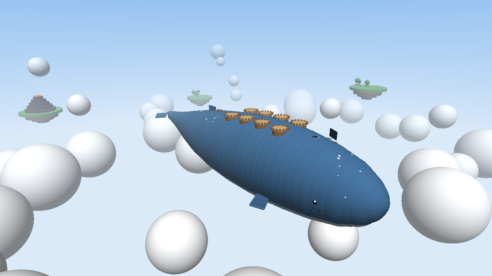

# Ride a Sky Whale

Een Roblox-game waarin iedereen in de server op de rug van een reusachtige vliegende walvis woont. Elke 10 minuten zwemt de walvis een nieuwe lucht in (onweer, sneeuwstorm, noorderlicht, eclips). Spelers schieten via het spuitgat de lucht in, zweven met hun glider door zwermen **Driftlings** en vangen ze. De Driftlings wonen daarna in hun nest en maken **Parels**.

Het volledige concept (kaart, verdienmodel, rekenvoorbeeld, bouwplan) staat op de conceptpagina die bij dit project hoort.



*Preview-render van de gegenereerde map (eenvoudige belichting, niet de echte Roblox-graphics).*

## Wat zit er in deze versie

| Onderdeel | Status |
| --- | --- |
| De walvis-map met 8 nesten, spuitgat, voerbak, Forecast-bord, wolkenzee en verre eilanden | Klaar |
| Spuitgat lanceert je ±180 studs omhoog, glider gaat vanzelf open | Klaar |
| Driftlings vangen door erdoorheen te vliegen (de server controleert elke vangst) | Klaar |
| 12 soorten, 6 zeldzaamheden, kansen zichtbaar in de Sky-dex | 10 vangbaar, 2 "coming soon" |
| 8 luchten die de wereldklok volgen, met eigen licht, weer en mutaties | Klaar |
| Elke lucht een drijvend eiland met betere Driftlings en een lanceerplatform | Klaar |
| Nest maakt Parels, ook offline (max 8 uur, aan 50%) | Klaar |
| Upgrades: net, nest, glider | Klaar |
| Migratie (rebirth): +25% Parels per keer | Klaar |
| Voerbak: 25 voerbeurten = walvislied (2x Driftlings voor de hele server) | Klaar |
| Gouden Feestmaal, Mega Feestmaal en Parelzak (Developer Products) | Klaar, ID's nog invullen |
| Game Passes: 2x Parels, VIP Kapitein, Weerman | Klaar, ID's nog invullen |
| Codes (`WHALEHELLO`, `SKYHIGH`) | Klaar |
| Vriendenbonus: +10% Parels per vriend in je server (max +40%) | Klaar |
| Opslaan met DataStores, veilige afhandeling van aankopen | Klaar |
| Piratennacht, ruilen, De Buik, wolkenvissen, eieren met Veren | Volgende updates |

De game is in het Engels, omdat de meeste Roblox-spelers Engels spreken. Roblox vertaalt de teksten automatisch naar andere talen, waaronder Nederlands.

## Online zetten (ongeveer 15 minuten)

### 1. Openen en testen
1. Installeer **Roblox Studio** via [create.roblox.com](https://create.roblox.com) en log in.
2. Open `RideASkyWhale.rbxl` (File > Open from File).
3. Druk op **Play** (F5). Je spawnt op de kop van de walvis. Loop naar het spuitgat ("JUMP IN!") en vlieg door de Driftlings.

Opslaan werkt in Studio pas na stap 2 hieronder. Tot dan speel je met een lege save; dat is normaal.

### 2. Publiceren
1. In Studio: **File > Publish to Roblox**.
2. Kies **Create new experience**, naam: `Ride a Sky Whale`, genre: Simulation. Klik op **Create**.
3. In Studio: **Game Settings > Security** en zet **Enable Studio Access to API Services** aan (dan werkt opslaan ook bij testen).

### 3. Instellen in de Creator Hub
Ga naar [create.roblox.com/dashboard/creations](https://create.roblox.com/dashboard/creations) en open je game.

1. **Avatar**: zet het avatartype op **R15**. Dat is nodig voor het hogere DevEx-tarief op uitgaven van 18+ spelers uit de VS.
2. **Places > jouw place > Server size**: zet hem op **8** (er zijn 8 nesten).
3. **Questionnaire**: vul de Maturity & Compliance-vragenlijst in. Zonder die vragenlijst kun je de game niet openbaar maken.
4. **Icon en thumbnails**: maak een icoon (close-up van het walvisoog met een avatar op haar kop) en 2 à 3 thumbnails.

### 4. Geld verdienen aanzetten
1. Maak in de Creator Hub onder **Monetization** deze producten aan:
   - Developer Products: `Golden Feast` (99 R$), `MEGA Feast` (449 R$), `Pearl Pack` (49 R$)
   - Passes: `2x Pearls` (399 R$), `VIP Captain` (249 R$), `Weatherman` (99 R$)
2. Kopieer van elk product en elke pass het **ID**.
3. Open in Studio **ReplicatedStorage > Shared > Config** en vul de ID's in bij `Config.PRODUCTS` en `Config.PASSES`.
4. **File > Publish to Roblox** om de update te publiceren.

### 5. Openbaar maken
Zet de game in de Creator Hub op **Public**. Roblox kan je vragen eerst je account te verifiëren.

## Instellingen aanpassen

Alles wat je wilt bijstellen staat in `src/shared/Config.luau` (in Studio: ReplicatedStorage > Shared > Config): prijzen-ID's, codes, offline-verdiensten, Feestmaal-duur, voerbak, aantal Driftlings in de lucht, lanceerkracht. Upgradeprijzen staan in `Upgrades.luau`, soorten en kansen in `Driftlings.luau`, de luchten in `Biomes.luau`.

Nieuwe code toevoegen voor een update:

```lua
Config.CODES = {
	WHALEHELLO = { pearls = 500 },
	SKYHIGH = { pearls = 1500 },
	STORMUPDATE = { pearls = 3000 }, -- nieuw
}
```

## Zelf bouwen vanuit de code

Voor wie met Rojo werkt. Installeer de tools uit `rokit.toml` (Rojo, Lune, luau-lsp) en draai:

```sh
./build.sh
```

Dat bouwt eerst de scripts met Rojo en voegt daarna met Lune de map toe (`tools/MapBuilder.luau`). Uitkomst: `RideASkyWhale.rbxl`. Voor live-sync met Studio: `rojo serve` (de map zit dan al in het geopende bestand).

## Hoe de code in elkaar zit

```
src/shared/   Config, SkyForecast (luchten uit de klok), Biomes, Driftlings, Upgrades, Format
src/server/   Main (start), PlayerData (opslaan), Economy (Parels, upgrades, codes, voeren),
              DriftlingService (spawnen en vangen), NestService (nesten), WorldService
              (wolken, vallen, glider, voerbak), Monetization (aankopen), DriftlingModel
src/client/   Main (start), SkyController (licht en weer), Movement (spuitgat en glider),
              CatchController (vangen), WorldFx (wolken, staart, Forecast-bord), Hud (scherm)
tools/        MapBuilder (bouwt de walvis), build-place (zet de map in het placebestand)
```

## Bekende beperkingen
- De game is gecontroleerd met de Roblox-typechecker en de logica is getest, maar nog niet in een echte Roblox-server gespeeld. Test daarom eerst in Studio en met een paar vrienden voordat je advertenties koopt.
- Opslaan gebruikt gewone DataStores met opslaan bij vertrekken, elke 90 seconden en bij afsluiten. Voor een grote game is [ProfileStore](https://github.com/MadStudioRoblox/ProfileStore) (met sessie-locking) een goede volgende stap.
- Geluiden gebruiken ingebouwde Roblox-geluiden. Eigen muziek en effecten maken het spel veel beter.
